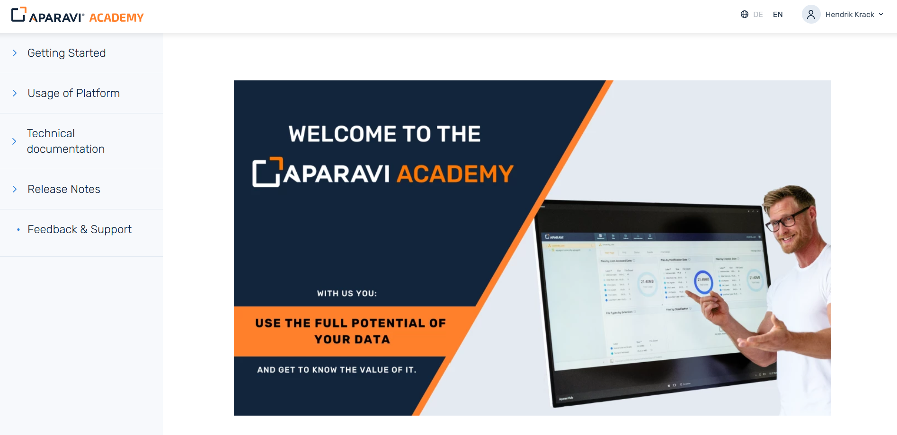
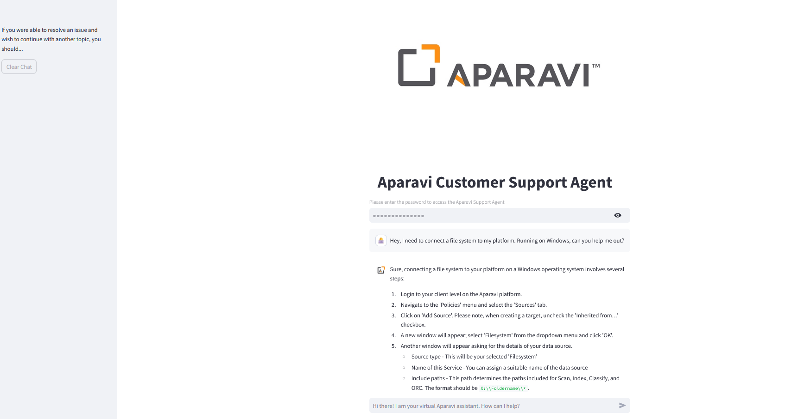

# Building an Intelligent Customer Support Chatbot for Aparavi

This guide walks you through building a sophisticated customer support chatbot for Aparavi using modern AI and web technologies. The system combines IBM Docling for document understanding, OpenAI embeddings for semantic search, BeautifulSoup for web scraping, and various other tools to create a powerful, context-aware support assistant.

The chatbot automatically processes Aparavi's documentation, learns from it, and provides accurate, contextual responses to user queries. It can handle both PDF documents and web content, making it a comprehensive solution for customer support automation.

Key Technologies Used:
- 🤖 IBM Docling for document parsing and understanding
- 🔍 OpenAI embeddings for semantic search capabilities
- 🌐 BeautifulSoup for web scraping
- 📊 Qdrant vector database for efficient similarity search
- 🎯 Streamlit for an intuitive user interface



## 💬 Chat Interface Preview

The chatbot provides an intuitive interface for users to ask questions about Aparavi's products and services:



## 🚀 Features

- Web scraping of Aparavi Academy documentation
- PDF document processing and text extraction
- Semantic search using OpenAI embeddings
- Vector storage with Qdrant
- Interactive chat interface with Streamlit
- Password-protected access
- Support for both English and German documentation

## 🛠️ System Requirements

- Python 3.8+
- OpenAI API key
- Qdrant Cloud account
- Access to Aparavi Academy

## 📋 Installation

1. Clone the repository:
```bash
git clone https://github.com/HendrikKrack/AparaviCustomerSupport.git
cd AparaviCustomerSupport
```

2. Install required packages:
```bash
pip install -r requirements.txt
```

3. Create/fill in the `.env` file in the root directory with the following variables:
```env
# Aparavi Credentials
APARAVI_EMAIL="your-email"
APARAVI_PASSWORD="your-password"

# OpenAI API Configuration
OPENAI_API_KEY="your-openai-api-key"

# Qdrant Cloud Configuration
QDRANT_URL="your-qdrant-url"
QDRANT_API_KEY="your-qdrant-api-key"

# Collection Configuration
COLLECTION_NAME="your-collection-name-here"

# Website Password
WEBSITE_PASSWORD="your-website-password"
```

## 🔄 ETL Pipeline

The system consists of several components that work together to create the knowledge base:

### 1. Web Scraper (`web_scraper.py`)
- Logs into Aparavi Academy
- Crawls documentation pages
- Saves URLs to `crawled_urls.json`

```bash
python etlPipeline/web_scraper.py
```

### 2. PDF Downloader (`pdf_downloader.py`)
- Downloads PDF documentation from crawled URLs
- Saves PDFs to `pdfs/` directory
- Creates `pdf_sources.json` mapping

```bash
python etlPipeline/pdf_downloader.py
```

### 3. PDF Processor (`pdf_processor.py`)
- Extracts text from PDFs
- Chunks text into manageable segments
- Preserves source information

```bash
python etlPipeline/pdf_processor.py
```

### 4. Vector Database Population (`vectorize_qdrant.py`)
- Generates embeddings using OpenAI
- Stores vectors in Qdrant
- Creates searchable knowledge base

```bash
python etlPipeline/vectorize_qdrant.py
```

## 🖥️ Running the Chat Interface

Launch the Streamlit interface:
```bash
streamlit run UserInterface.py
```

The interface will be available at `http://localhost:8501`

## 🔒 Security

- All sensitive credentials are stored in `.env`
- Web interface is password-protected
- API keys are never exposed in the frontend

## 📁 Project Structure

```
AparaviCustomerSupport/
├── .env                    # Environment variables
├── requirements.txt        # Python dependencies
├── UserInterface.py        # Streamlit chat interface
├── images/                 # UI assets
│   ├── headLogoAparavi.png
│   └── aparaviLogoIcon.jpg
└── etlPipeline/           # Data processing scripts
    ├── web_scraper.py
    ├── pdf_downloader.py
    ├── pdf_processor.py
    └── vectorize_qdrant.py
```

## 📝 Preview README on GitHub

To preview how this README will look on GitHub before committing:

1. **Using VS Code**:
   - Install the "Markdown Preview Enhanced" extension
   - Open README.md
   - Press `Ctrl+Shift+V` (Windows) or `Cmd+Shift+V` (Mac)
   - Or click the preview icon in the top-right corner

2. **Using Online Tools**:
   - Visit [GitHub Markdown Editor](https://readme.so/editor)
   - Copy and paste this README content
   - See live preview on the right

3. **Local Preview**:
   ```bash
   # Install grip (GitHub README Instant Preview)
   pip install grip
   
   # Run preview server
   grip README.md
   ```
   Then open `http://localhost:6419` in your browser

## 🔍 How It Works

1. **Data Collection**: The system first scrapes the Aparavi Academy website for documentation
2. **Processing**: PDFs are downloaded and processed into text chunks
3. **Vectorization**: Text chunks are converted into embeddings and stored in Qdrant
4. **Search**: User queries are converted to embeddings and matched against the database
5. **Response**: The AI combines relevant documentation with natural language responses

## ⚠️ Important Notes

- Run the ETL pipeline scripts in order (web_scraper → pdf_downloader → pdf_processor → vectorize_qdrant)
- Ensure all environment variables are properly set before running any scripts
- The Qdrant collection will be recreated if vector dimensions don't match
- Keep your API keys and credentials secure

## 🤝 Support

For additional support:
- English: https://www.aparavi.com/contact-us
- German/European: https://www.aparavi.com/de/kontakt

## 📚 Documentation

For more information about Aparavi products and services, visit:
- Aparavi Academy: https://aparavi-academy.eu/en